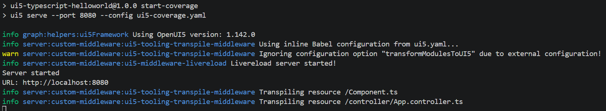
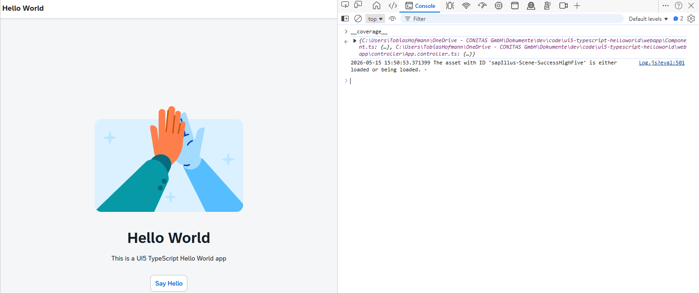
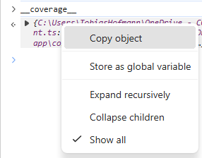
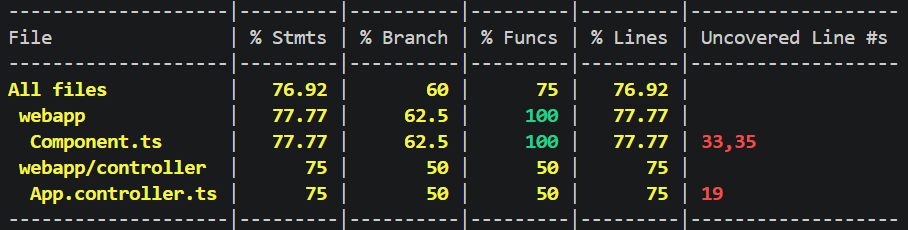
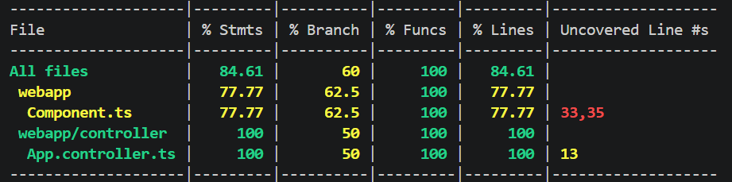
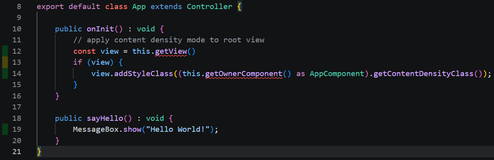
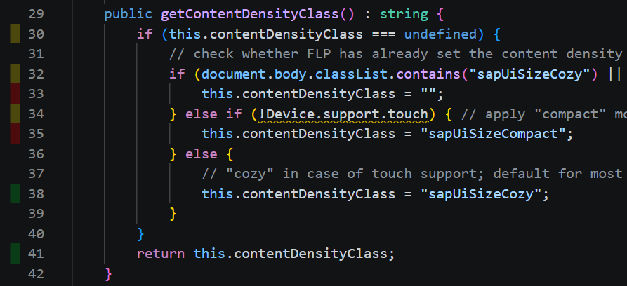

# Code Coverage

Run UI5 app with code coverage. This options comes ootb with the TypeScript sample. Under the hood, this command uses istanbul to instrument the coding. You have nothing to do in regards to transpiling TypeScript to JavaScript and to instrument the code. It just works.

```sh
npm run start-coverage
```

This instruments the files automatically.



The object \_\_coverage\_\_ is available in the browser.



This object can be captured by the user.



Copy the object after loading the page, not clicking on the say hello button. The object can be saved locally, e.g. in the folder coverage as file coverage.json. The coverage data can be analyzed by nyc.



## NYC

[nyc is the cli for instanbul](https://github.com/istanbuljs/nyc)

### Installation

```sh
npm i --save-dev nyc
```

### Running

```sh
npx nyc report --reporter=html --reporter=text --temp-dir=coverage/ --report-dir=coverage_result
```

Taking as input the coverage data - after opening the say hello dialog. The report shows that more lines are covered (the ones linked to the dialog).



## Display in VS Code editor

The coverage data can be used to show the covered and uncovered lines of code in VS Code or SonarQube. For VS Code, an extension is needed. To be able to reuse the coverage data, it must be converted to lcov format.

```sh
npx nyc report --reporter=lcov --reporter=text --temp-dir=coverage/ --report-dir=coverage_result
```

This generates the file [lcov.info](./coverage_result/lcov.info).

The lcov.info file can be used by e.g. [Coverage Gutters](https://marketplace.visualstudio.com/items?itemName=ryanluker.vscode-coverage-gutters) to display the lines covered / not covered by the test.

Fully covered: App.controller.ts



Partially covered: Component.ts


