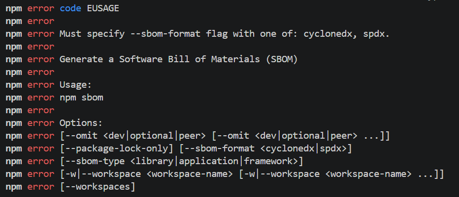

# Software Bill of Materials - SBOM Example

A software [bill of material (SBOM)](https://en.wikipedia.org/wiki/Bill_of_materials) is part of a [software supply chain](https://en.wikipedia.org/wiki/Software_supply_chain). It lists the software used by the product and serves as an inventory of the software used. An SBOM offers the benefit for the software users to know what is part of it, to gain insights and to manage the risks that come with using 3rd party software:

* licenses
* vulnerabilities

There exists a few alternative SBOM standards and software to generate those. The main standards are [SPDX](https://en.wikipedia.org/wiki/Software_Package_Data_Exchange) and [CycloneDX](https://github.com/CycloneDX). SPDX stems from the need to improve license compliance.  This is the area where it performs best. CycloneDX is from [OWASP](https://cyclonedx.org/) and lays its focus more on the security part. An [overview of both can be found at sonatype](https://www.sonatype.com/blog/comparing-sbom-standards-spdx-vs.-cyclonedx-vs.-swid).

## Generate SBOM

This example will use the CycloneDX format for SBOM. [npm includes a command](https://docs.npmjs.com/cli/v11/commands/npm-sbom) to generate an SBOM. The command is npm sbom.

```sh
npm sbom
```

The parameter which sbom format to use is mandatory.



```sh
npm sbom --sbom-format cyclonedx
```

The command will print out the sbom on the terminal. To store it in a file, add > sbom.json.

```sh
npm sbom --sbom-format cyclonedx > sbom.json
```

Other parameters define what to include in the sbom. For instance, the parameter omit defines whether [devDependencies](https://docs.npmjs.com/cli/v11/configuring-npm/package-json#devdependencies) are included or not.

* optional to exclude [optionalDependencies](https://docs.npmjs.com/cli/v11/configuring-npm/package-json#optionaldependencies)
* peer to exclude [peerDependencies](https://docs.npmjs.com/cli/v11/configuring-npm/package-json#peerdependencies)

## What to include

An SBOM should contain the dependencies included in a released software product. Everything that is shipped with the software. Regarding a web application like UI5 that is developed using [NPM](https://www.npmjs.com/) and [Node.JS](https://nodejs.org) and , the SBOM should include all dependencies listed under dependencies.

### Production

For a project that is shipped as a release or run in a production environment, the sbom should include everything that is part of the release. All dependencies that are part of it and included in the software run by the user. For npm, thats basically all dependencies that are not part of devDependencies in package.json

```sh
npm sbom --sbom-format cyclonedx --omit dev --sbom-type application > sbom.json
```

### Development

It makes sense to know also all dependencies used during development. In case a dependency has a security or license issue you want to know this. As this might affect the development process, the sbom should be created for development versions too.

```sh
npm sbom --sbom-format cyclonedx --sbom-type application > sbom.json
```

## Examples: SPDX Format

### Sample SBOM including devDependencies

```sh
npm sbom --sbom-format spdx --omit dev sbom-type application > sbom_prd.json  
```

SBOM: [sbom_prd.json](./sbom_prd.json)

```sh
npm sbom --sbom-format spdx sbom-type application > sbom_dev.json
```

SBOM: [sbom_dev.json](./sbom_dev.json)


## Examples: CycloneDX format

### Sample SBOM including devDependencies

```sh
npm sbom --sbom-format cyclonedx --omit dev sbom-type application > sbom_cyclonedx_prd.json  
```

SBOM: [sbom_dev.json](./sbom_cyclonedx_prd.json)

### Sample SBOM including devDependencies

```sh
npm sbom --sbom-format cyclonedx --sbom-type application > sbom_cyclonedx_dev.json  
```

SBOM: [sbom_dev.json](./sbom_cyclonedx_dev.json)
