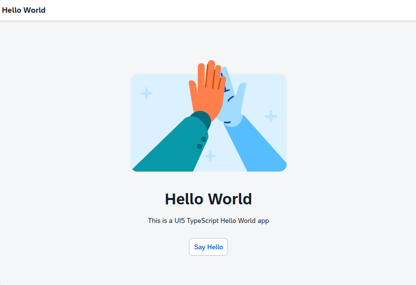
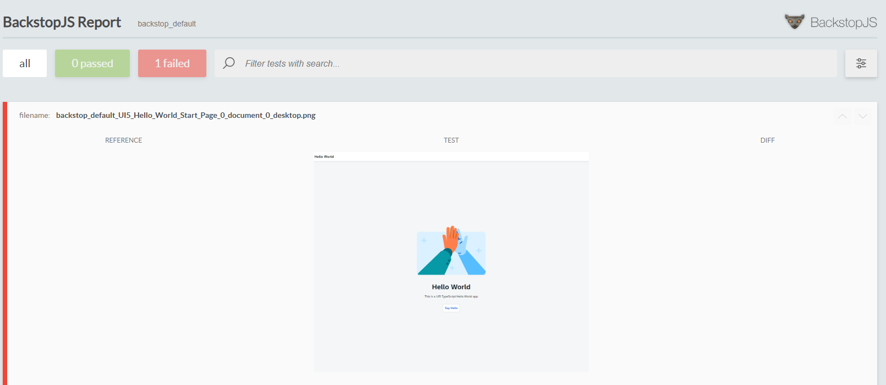
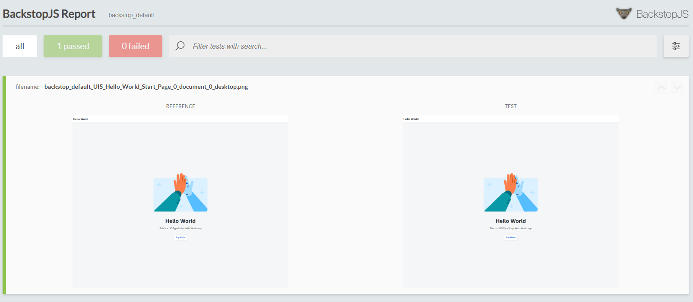
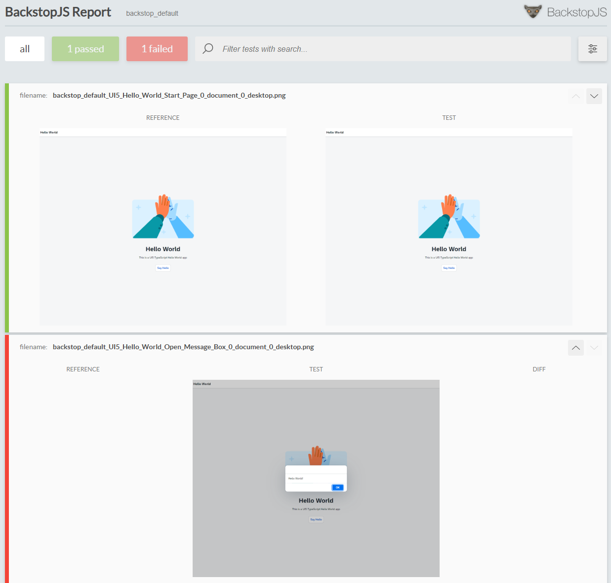
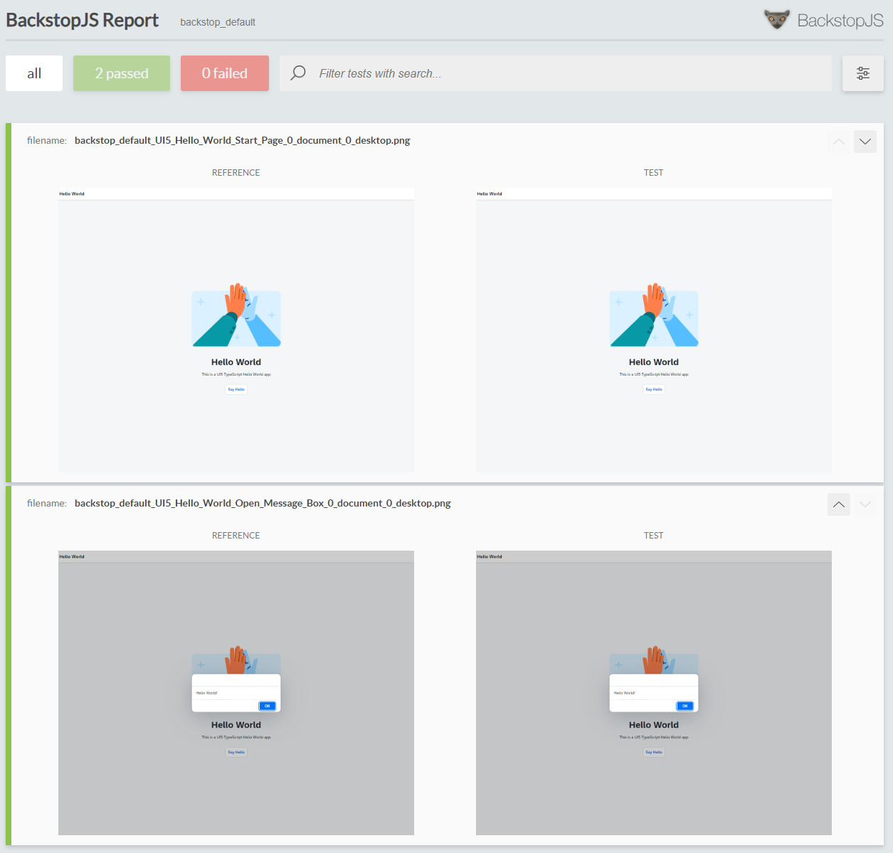

# Visual Regression Test Example

For the visual regression test, BackstopJS is used as described [here](https://www.itsfullofstars.de/2024/09/visual-regression-testing/).

**Information** This branch already contains the configuration and results for the visual regression tests. To see the result, open file file [index.html](backstop_data/html_report/index.html) in your web browser. To start everything from scratch, delete the folder backstop_data and the file backstop.json.

## Installation

```sh
npm install --save-dev backstopjs
```

## Initialization of BackstopJS

Run backstop init to let the tool set up the required files.

```sh
.\node_modules\.bin\backstop init
 or
npx backstop init
```

## Configuration

### Add npm script

Add to package.json a script to run the BackstopJS test command.

```json
"scripts": {
    "visual-test": "backstop test"
    ...
}
```

Additional configuration regarding the tests and how to run them is done in the file [backstop.json](./backstop.json). It is used to configure BackstopJS.

### Devices

Adjust the used devices. Devices and the screen size for mobile, tablet or desktop can be configured. For the project, only tests for a desktop screen size are used.

```json
"viewports": [
    {
    "label": "desktop",
    "width": 1280,
    "height": 1024
    }
],
```

### UI Test (Scenarios)

Adjust the UI tests. These are named scenarios and are provided as an object. To make the browser open the UI5 hello world start page, configure the url property to use http://localhost:8080/index.html

```json
"scenarios": [
    {
      "label": "UI5 Hello World Start Page",
      "cookiePath": "backstop_data/engine_scripts/cookies.json",
      "url": "http://localhost:8080/index.html",
      "referenceUrl": "",
      "delay": 5000,
      ...
    }
]
```

#### Additional parameters

The delay parameter makes the browser wait for 5 seconds. This should give the UI5 app enough time to load the resources and draw the start page.

## UI5 Hello World start page

The start page of the UI5 Hello World application displays a simple message.



## Run visual regression test

The steps for running a visual regression test are:

1. Start the app to be tested
2. Setup the baseline for the test (take initial screenshots)
3. Run the test and validate result against baseline screenshots

### 1. Run app

Run the UI5 app in a separate terminal and keep the app running.

```sh
npm run start
```

Output:

```sh
> ui5-typescript-helloworld@1.0.0 start
> ui5 serve --port 8080 -o index.html

info graph:helpers:ui5Framework Using OpenUI5 version: 1.142.0
info server:custom-middleware:ui5-middleware-livereload Livereload server started!
Server started
URL: http://localhost:8080
```

### 2. Generate Baseline

```sh
npm run visual-test
```



To add the screenshot to the baseline:

```sh
npx backstop approve
```

### 3. Run Visual Regression Test



## Add UI test: open message box

Adding an additional test follows the same steps outlined above. This test is now adding some interactivity as the button to open the message box is clicked. The ID of selector of the button is: "#container-ui5\\.typescript\\.helloworld---app--helloButton-BDI-content".

### Add test scenario

Add the following test to backstop.json:

```json
"scenarios": [
    {
        // other tests
    },
    {
        "label": "UI5 Hello World Open Message Box",
        "cookiePath": "backstop_data/engine_scripts/cookies.json",
        "url": "http://localhost:8080/index.html",
        "referenceUrl": "",
        "readyEvent": "",
        "readySelector": "",
        "delay": 5000,
        "hideSelectors": [],
        "removeSelectors": [],
        "hoverSelector": "",
        "clickSelector": "",
        "postInteractionWait": 0,
        "selectors": [
            "#container-ui5\\.typescript\\.helloworld---app--helloButton-BDI-content"
        ],
        "selectorExpansion": true,
        "expect": 0,
        "misMatchThreshold" : 0.1,
        "requireSameDimensions": true
    }
]
```

### Add test to baseline

Run the test to add the message box test to the baseline.

```sh
npm run visual-test
```

Result:



Add the test

```sh
npx backstop approve
```

### Run UI test

Re-run the test

```sh
npm run visual-test
```

Result:


