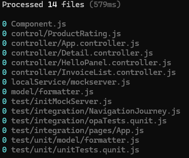
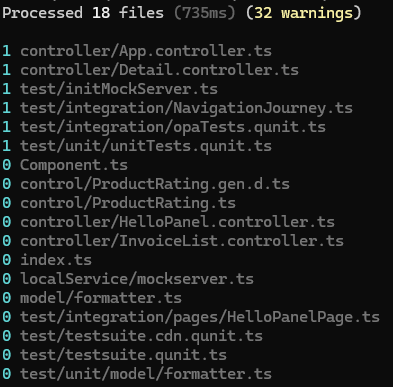
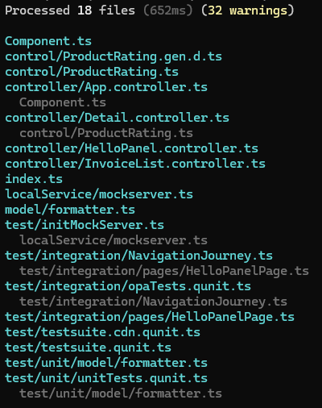
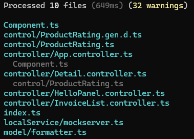
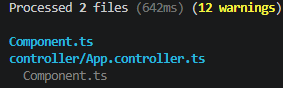

# Module dependency (madge) example

Knowding module dependencies help developers understand the complexitiy and connection within an application. When you develop an UI5 or Fiori app, you'll have dependencies between JavaScript files: Component controller, Base module, formatter, etc. Having a tool displaying these helps in understanding dependencies between modules / controllers as well as seeing where a change might impact another module / controller.

For Javascript, [madge](https://github.com/pahen/madge) is a tool that allows to discover and visualize these dependencies.

## Installation

Madge is installed via npm

```sh
npm -g install madge
```

## UI5 apps

### Javascript UI5 apps

Madge won't work with JavaScript UI5 apps. For instance, take the [Walkthrough app](https://ui5.sap.com/#/demoapps) for JavaScript.

```sh
madge ./webapp
```

Output



Madge finds the JS files, but no dependency between them.

### Typescript UI5 apps

As an example, take the [TypeScript version of the Walkthrough](https://ui5.github.io/tutorials/walkthrough/).

```sh
madge --extensions ts webapp -s
```

Output



Dependencies are found.

```sh
madge --extensions ts webapp
```



Top exclude the test files, add -x text

```sh
madge --extensions ts -x test webapp
```



## Hello World app

For the UI5 TypeScript hello world app used in this repo, madge can show a base dependency graph.

```sh
madge --extensions ts -x test webapp
```



madge takes into consideration the import of Component in the App controller.

```ts
import MessageBox from "sap/m/MessageBox";
import Controller from "sap/ui/core/mvc/Controller";
import AppComponent from "../Component";
```
