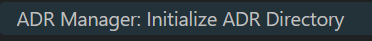
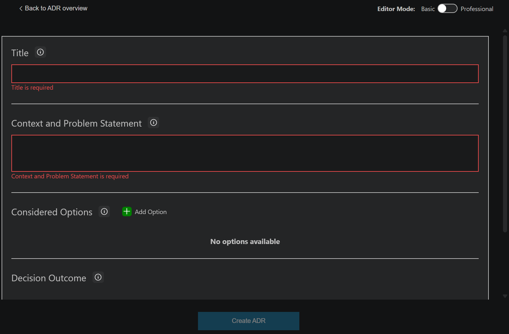
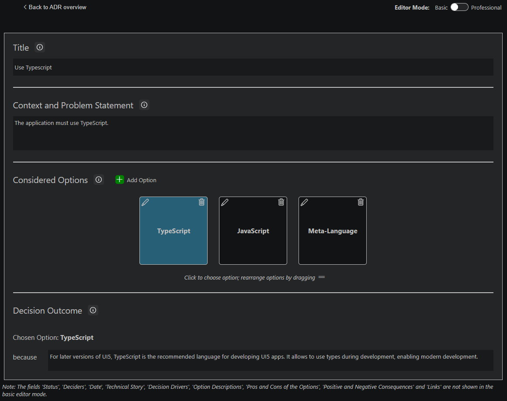
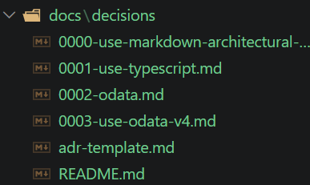

# Architecture Decision Record Example

An  [Architecture Decision Record (ADR)](https://adr.github.io/) captures Architectural Decisions (AD). Each single AD is captured in one ADR. The ADRs are stored alongside the project and document the reasons why certain architectural decisions were taken. The sum of all ADRs in a project are the decision log.

ADRs are best written as plain text. The _main two_ formats used are [Nygard](https://cognitect.com/blog/2011/11/15/documenting-architecture-decisions.html) and [Markdown Architectural Decision Records (MADR)](https://www.ozimmer.ch/practices/2022/11/22/MADRTemplatePrimer.html). Both try to achieve the same: make it easy to capture the necessary information. Specially for the MADR format you have the option between a short and a longer format.

The ADR example in this project is going to use MADR.

MADR comes in two flavors: [minimal](https://github.com/adr/madr/blob/4.0.0/template/adr-template-minimal.md?plain=1) and [complete](https://github.com/adr/madr/blob/4.0.0/template/adr-template.md?plain=1). The [VS Code extension ADR Manager](https://marketplace.visualstudio.com/items?itemName=StevenChen.vscode-adr-manager) was used to create the ADRs for this project. The default loation for storing ADRs was not changed: docs/decisions

1. Initialize the ADR directory



2. Add a new ADR



Sample



Resulting ADR as markdown:

```md
# Use Typescript

## Context and Problem Statement

The application must use TypeScript.

## Considered Options

* TypeScript
* JavaScript
* Meta-Language

## Decision Outcome

Chosen option: "TypeScript", because For later versions of UI5, TypeScript is the recommended language for developing UI5 apps. It allows to use types during development, enabling modern development.
```

The above wizard creates a simple ADR. For a more sophisticated ADR, activate the professional mode.


## Using ADRs

Using ADRs allows to objectively understand the architectural boundaries an app follows. Sharing these between apps / solutions makes it easier to understand and to follow app guidelines. By just looking at the ADRs added to this repo, it is already possible to understand the base constaints of the app.



The app is using TypeScript and OData v4. Extending the list allows to get a clear understanding of how the app works. Later on, this knowledge can be used by other developers, teams, and even AI tools to continue writing and improving the app, without having to redfine and understand the underlying architectural decisions.
