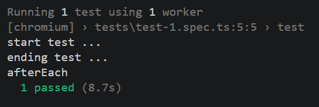
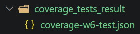
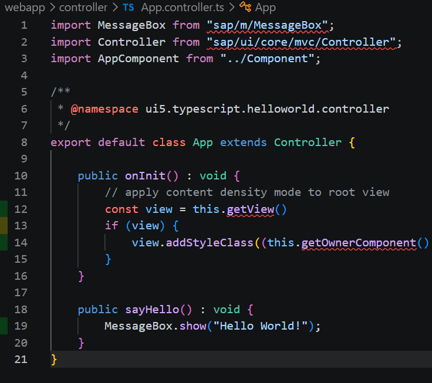
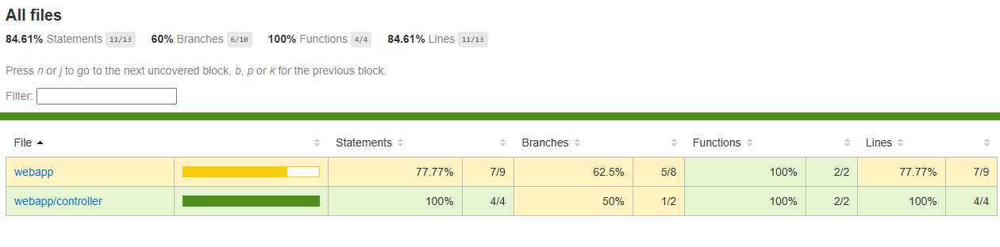
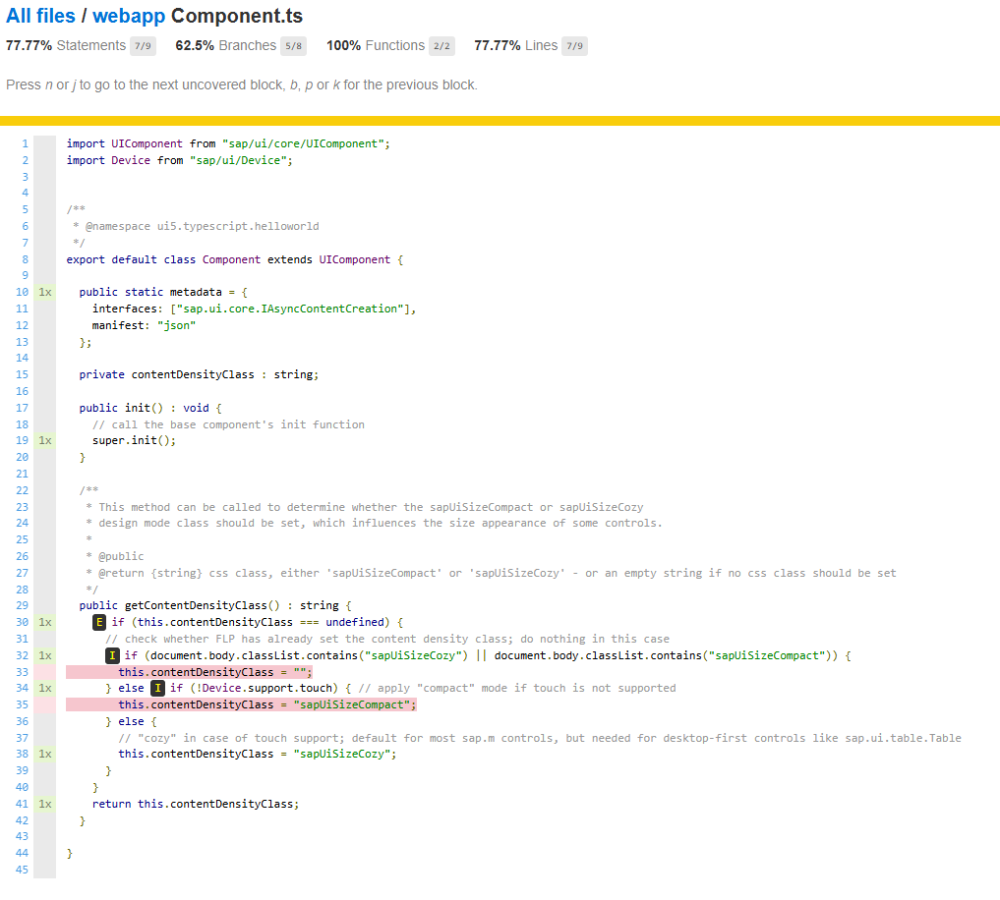

# Code Coverage with Playwright Example

The approach for retrieving the code coverage with Playwright is to record UI tests and run them against an app that is serving an instrumented app. The UI5 app tested is run with code coverage activated. The UI tests are the same as for "normal" testing. The difference is that the code coverage data is captured at the end of each test. It is stored locally and then analyzed by nyc and combined into a report or lcov file.

## Prerequisites

- Install Playwrigt. See [branch playwright](https://github.com/tobiashofmann/ui5-typescript-helloworld/tree/playwright) for more information on how to do this.
- Install nyc for code coverage. See [branch code-coverage](https://github.com/tobiashofmann/ui5-typescript-helloworld/tree/code-coverage) for more information on how to do this.

### Playwright

```sh
npm init playwright@latest
```

### UI Test

The example in this repos is a simple test that loads the page and opens the dialog.

```javascript
test('test', async ({ page }) => {
  await page.goto('http://localhost:8080/index.html');
  await page.getByRole('button', { name: 'Say Hello' }).click();
  await page.getByRole('button', { name: 'OK' }).click();
});
```

### Capture coverage

Capture the \_\_coverage\_\_ object from the browser after each test. Save it locally to disk using a unique file name.

```javascript
test.afterEach(async ({ page }, testInfo) => {
  const coverage = await page.evaluate(() => (window as any).__coverage__ ?? null);
  const dir = path.join('coverage_tests_result');
  fs.mkdirSync(dir, { recursive: true });
  const fileNameSafe = testInfo.title.replace(/[^a-z0-9-_]+/gi, '_').slice(0, 80);
  const file = path.join(dir, `coverage-w${testInfo.workerIndex}-${fileNameSafe}.json`);
  fs.writeFileSync(file, JSON.stringify(coverage), 'utf-8');
});
```

## Code Coverage

### Run App with coverage enabled

```sh
npm run start-coverage
```

### Run UI test

Run the Playwright test.



The test coverage data from __coverage__ ist stored in the directory [coverage_tests_result](./coverage_tests_result/). The file name is unique. When there are more tests or workers, file files should not overwrite themselves during a test run.



### Create coverage report

nyc can be used to read the files in dir coverage_tests_result and combine them in one single report or lcov file.

```sh
npx nyc report --reporter=lcov --temp-dir=coverage_tests_result/ --report-dir=coverage
```

## Analyse result

The lcov.info file can be used to find out which lines of code are covered by the UI tests. They can be used in the IDE or in a tool like SonarQube.



The coverage results can also be displayed in the web report.




