# Dependency Track Example

[Dependency Track](https://dependencytrack.org/) is a software from [OWASP](https://owasp.org/www-project-dependency-track/). It helps to analyze SBOMs and give transparency over your software stack. Software is analyzed for security issues and helps to identify licensing issues. The software is [available on GitHub](https://github.com/DependencyTrack/dependency-track) as open source. The easiest way is to run it via Docker.

Dependency Track supports SBOM in the CycloneDX format. Support for SPDX was removed and may come back. The npm sbom command can create a cyclonedx SBOM, but the resulting JSON is marked as invalid by Dependency Track. Therefore, this example is using a tool from CycloneDX to create the SBOM: [cyclone-node-npm](https://github.com/CycloneDX/cyclonedx-node-npm)

## Steps

The steps to analyze a project are

1. Generate SBOM
2. Configure user
3. Configure Dependency Track
4. Upload SBOM
5. Access Dependency Track dashboard

## 1. Generate SBOM

Generate SBOM in CycloneDX format for DEV case. First run npm i to ensure the dependencies are resolved and available. Then generate the sbom.

```sh
npm i
npx @cyclonedx/cyclonedx-npm -o sbom_dev.json
```

The SBOM is stored in [file](./sbom_dev.json).

**Note** Creating the SBOM in CycloneDX format with npm sbom should work. However, Dependency Track rejects the SBOM as invalid.

```sh
npm sbom --sbom-format cyclonedx > sbom_dev.json
```

The SBOM generated by npm sbom gets rejected. Run the http sample upload_sbom.http to a project to get the error message from Dependency Track.

```json
{
  "status": 400,
  "title": "The uploaded BOM is invalid",
  "detail": "Unable to determine schema version from JSON"
}
```

## 2. Configure user

For the following steps, set up your Dependecy Track instance (e.g. Docker) and ensure it is up and running and you do have an (admin) user.

### Create a user

Ensure you do have a user in DT.

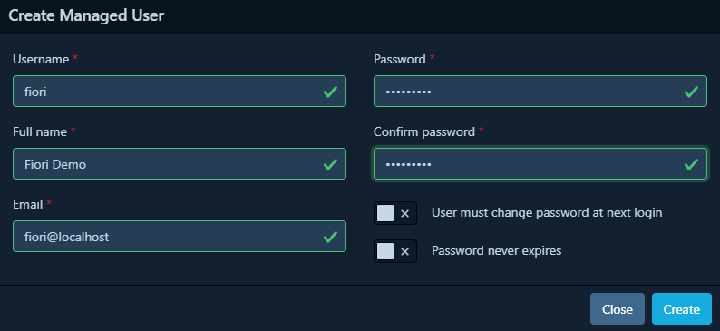

Asssign the necessary permissons to work with DT: create a project and submist a SBOM.

### Create a new team

Create a new team named Fiori.

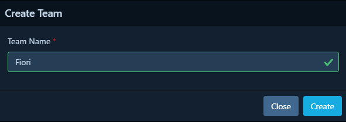

### Create API key

Create a new key. This is the key used by when uploading the sbom. Store the key somewhere.

Example key: odt_aiO7FIQy_FS2evDCl8uyEIMOdhFUXWjgZXhDzav4m

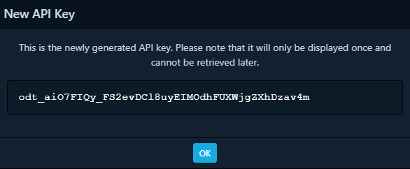

### Add permissions

Add the needed permissions to the team. For tests purposes you might add all permissions.

### Assign user to team

On the user manage page, add the fiori user to team Fiori.

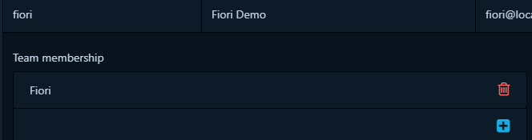

## 3. Configure Dependency Track

### SBOM format

Enable support for CycloneDX SBOM format.

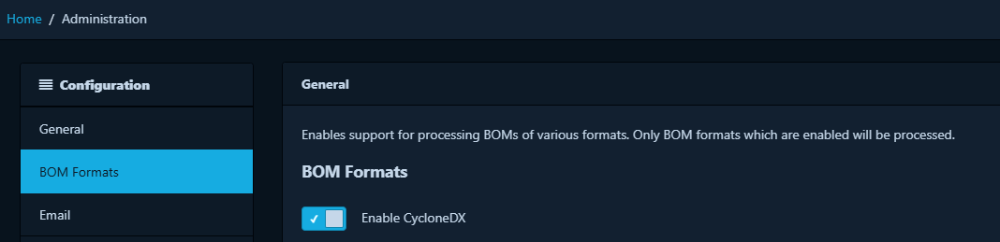

### Analyzers

Dependcy Track supports several analyzers. Active the ones you want to use. The internal one needs no special configuration. To enable Sonatype or Trivy, follow the instructions below.

#### SonaType

A (free) user with a valid API token is needed. As the [documentation states](https://docs.dependencytrack.org/datasources/ossindex/) an API token is required.

#### Trivy

To be able to use Trivy you need to set up a [local Trivy instance](https://docs.dependencytrack.org/datasources/trivy/). Instructions on [how to set up your own Trivy instance](https://trivy.dev/docs/latest/getting-started/installation/) are on the Trivy documentation site.

### Vulnerabilities

NVD and GitHub should be activated. An API key is needed. For [NVD, follow the instructions](https://nvd.nist.gov/developers/request-an-api-key). For GitHub, [create a personal access token](https://docs.github.com/en/authentication/keeping-your-account-and-data-secure/managing-your-personal-access-tokens).

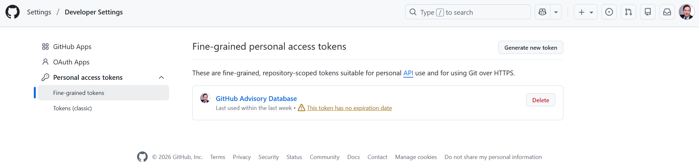

## Create Dependency Track Project

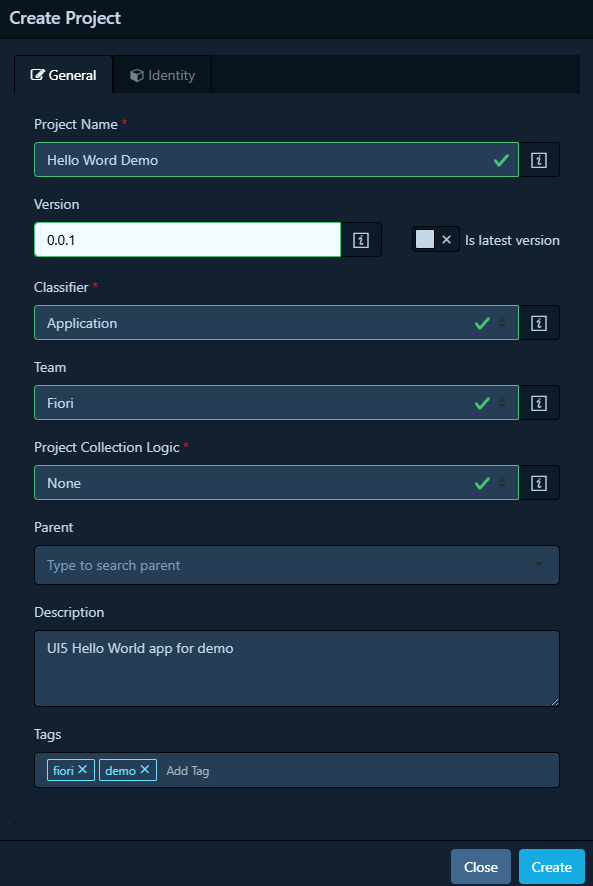

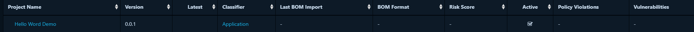

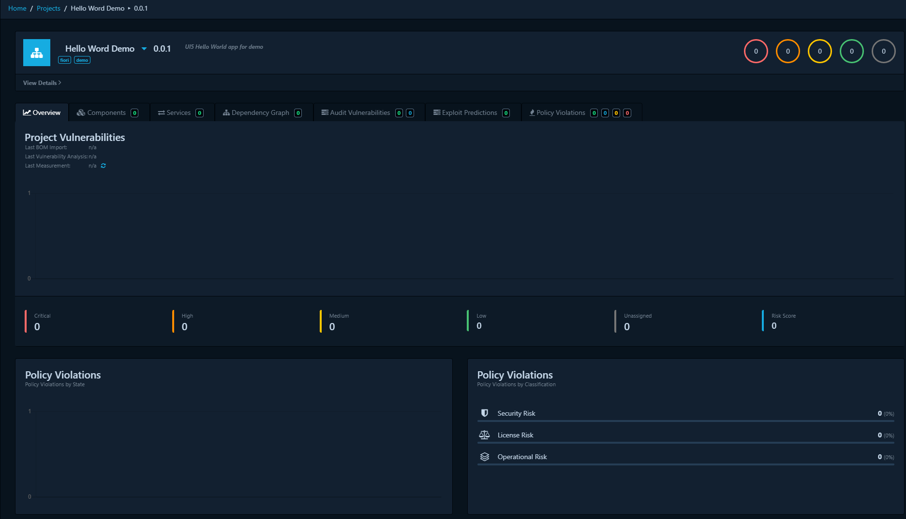

### Get Object key

Expand the project details. Copy the prject identifier (object identifier).

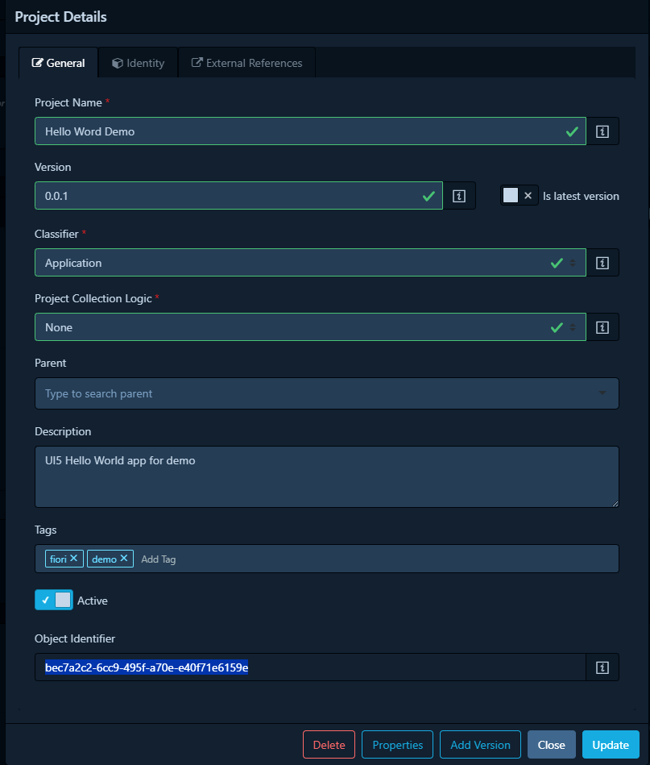

## 4. Submit SBOM

Uploading the SBOM to Dependency Track is done by [calling the API](https://docs.dependencytrack.org/usage/cicd/). The SBOM is provided as the payload. 

```
curl -X "PUT" "http://dtrack.example.com/api/v1/bom" \
     -H 'Content-Type: application/json' \
     -H 'X-Api-Key: LPojpCDSsEd4V9Zi6qCWr4KsiF3Konze' \
     -d $'{
  "project": "f90934f5-cb88-47ce-81cb-db06fc67d4b4",
  "bom": "PD94bWwgdm..."
  }'
```

Create the SBOM as shown above in step 1. (Sample sbom: [sbom_dev.json](./sbom_dev.json)).

```sh
npx @cyclonedx/cyclonedx-npm -o sbom_dev.json
```

Then upload the SBOM: convert the XML to Base64 and send it to the Dependency Track API server with the correct payload.

```sh
npm run upload
```

Result

```json
Success: { token: '8b85f55d-1a9b-4d4c-81e6-22cbe2e77e12' }
```

## 5. Analyze Project in Dependency Track

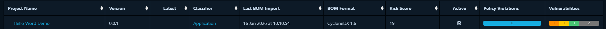


From the project dashboard it can be easily seen if any outdated projects are used or if there are any security vulnerabilities.

### Outdated components

The dashboard provide a convinient way to get an overview of outdated components used in the project. While this is not a security risk per se, it shows what can turn into a security risk. Updating components is also a task that can be seen as necessary. In the example below, there are 330 outdated compnents out from 720.

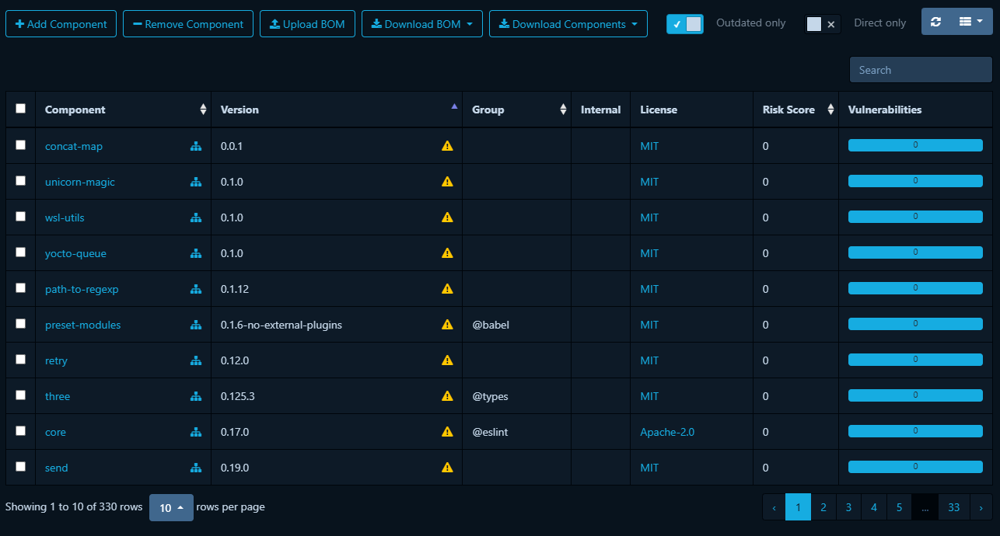

### Security vulnerabilities

An important metric is the number of security vulnerabilities. It might not be as important for a development version as it is for a released, productive, shipped and used by users version. Getting the number to 0 should always be a goal.

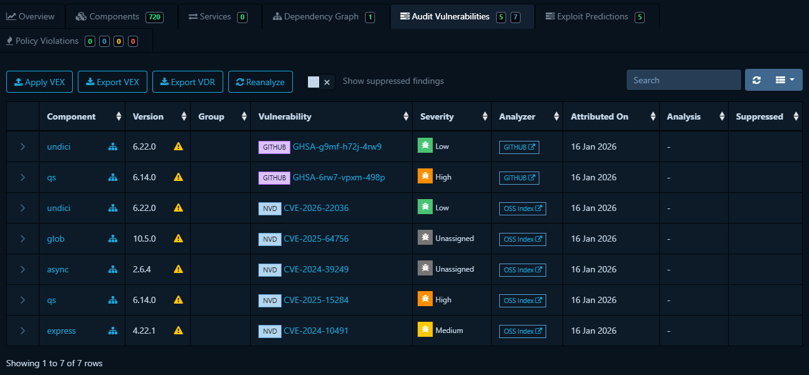

Dependency Track shows details to a CVE finding and the risk score.

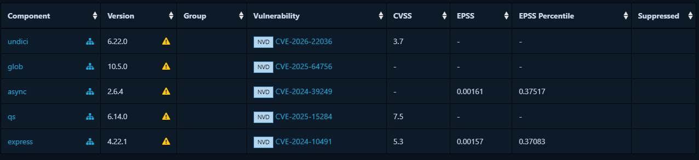

From the dasboard, you can explore more information about the finding, the CVE text or the dependency graph to find out how the affected project was added to your project.

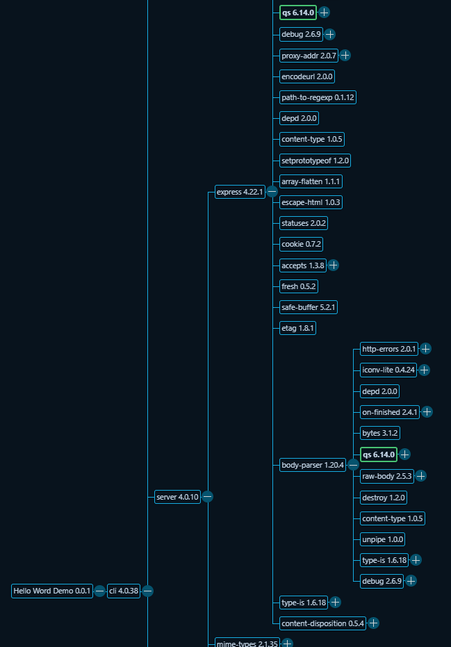

## Production version

A SBOM generated for the productive version helps to understand what is shipped in a release. As devDependencies are not part of the final product, it makes sense to exclude these from the SBOM. A security issue reported on a component that is not part of the final release must not be fixed. If the affected component is only part of the dev version, it only must be fixed there and the priority of fixing the dependency can be lower.

### Create SBOM
To know what is part of a release, the SBOM can be created without dev dependencies. Sample output file: [sbom_prd.json](./sbom_prd.json).

```sh
npx @cyclonedx/cyclonedx-npm --omit dev -o sbom_prd.json
```

### Create project for release in Dependency Track

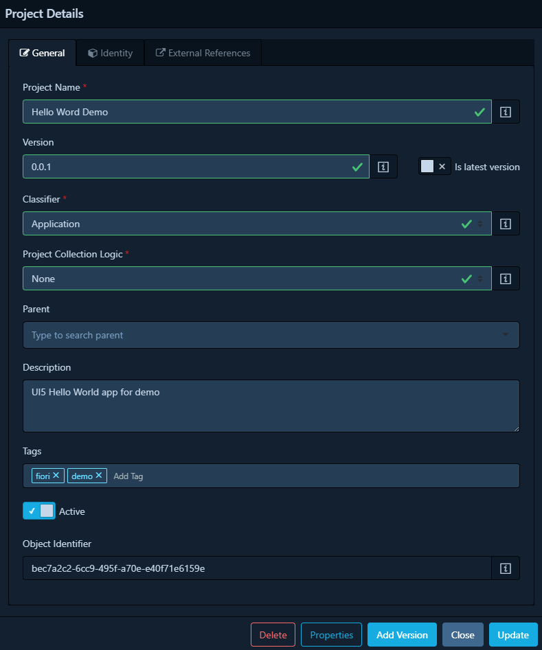

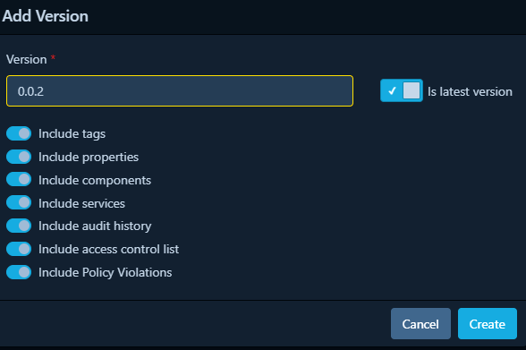

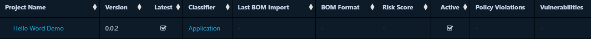

### Upload SBOM

Upload the new SBOM to Dependency Track. Convert the SBOM to Base64 and add the new project ID to the payload.

```sh
npm run upload
```

### Analyze

The productive SBOM is analyzed by Dependency Track and will show less components and vulnerabilites (0 in total).

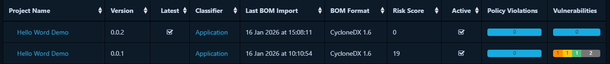
