# Playwright Example

[Playwright](https://playwright.dev/) is a tool that allows to easily record, develop and run web tests. It's vantage compared to [Puppeteer](https://pptr.dev/) is that it spports Chromium Firefox and Webkit. There is a very good integration into VS Code via an extension available. The company behind Playwright is [Microsoft](https://en.wikipedia.org/wiki/Playwright_(software)).

## Installation

Playwright can be installed on the cli or as a VS Code extension. The best way is to use it as a VS Code extension.

For the playwright test creation and running ensure that the app to be tested is up and running. For the UI5 hello world app, run it in the terminal and keep the up running.

### CLI

To install playwright and add it to your current project, run:

```sh
npm init playwright@latest
```

You'll have to answer a few questions and the install script will take care of the rest. The script will also install the browsers: chrome, firefox and webkit.

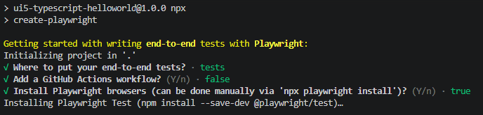

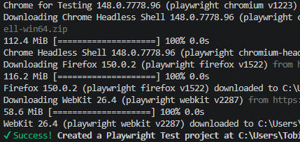
### VS Code

Install the official extension from the VS Code marketplace: 

- https://marketplace.visualstudio.com/items?itemName=ms-playwright.playwright
- https://playwright.dev/docs/getting-started-vscode

## Create test

Open the test view and click on Record new

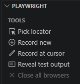

A browser opens. Enter the URL of the app to be tested and perform the user actions.

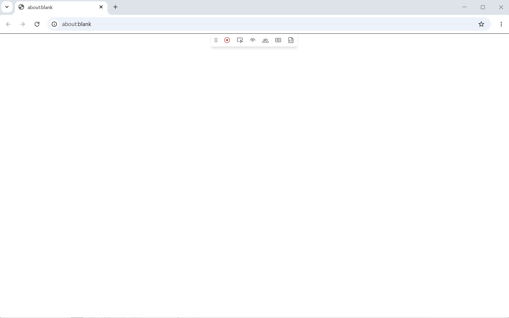

Enter the URL of the app to be tested: http://localhost:8080/index.html

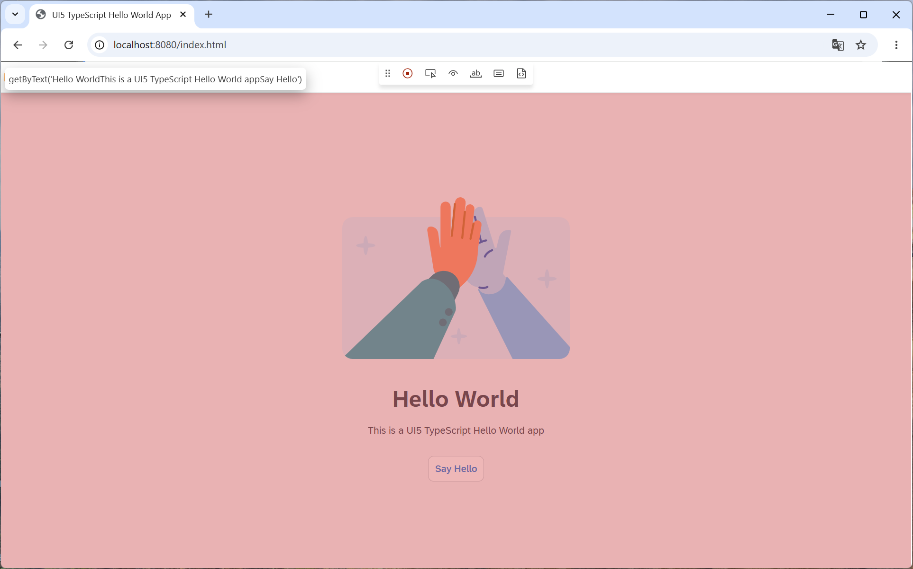

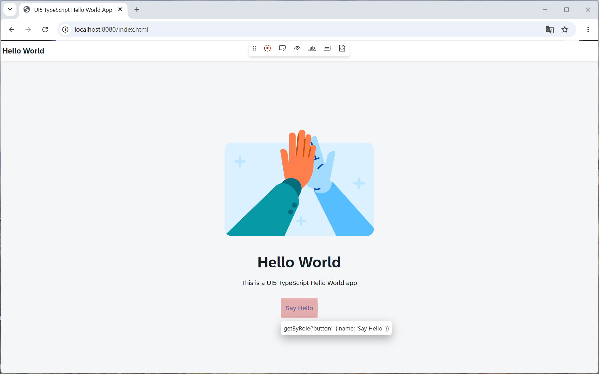

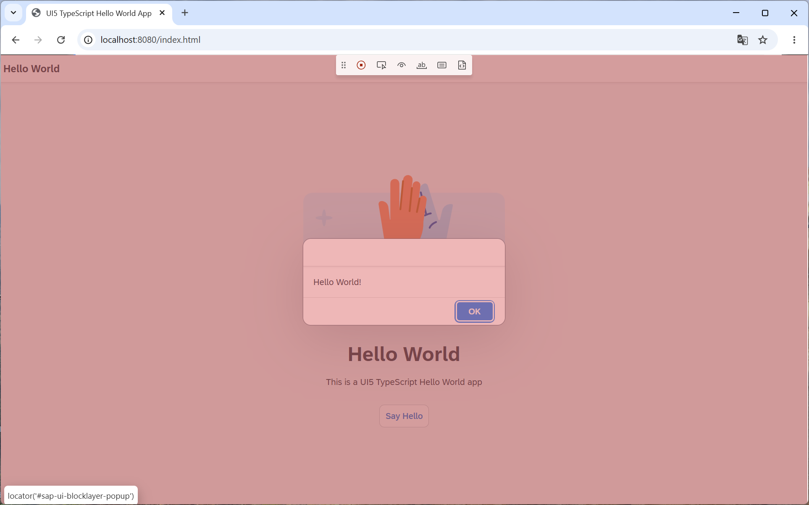

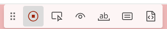

## Test recording

Result (see file [tests/test-1.spec.ts](./tests/test1.spec.ts)):

```javascript
import { test, expect } from '@playwright/test';

test('test', async ({ page }) => {
  await page.goto('http://localhost:8080/index.html');

  await page.getByRole('button', { name: 'Say Hello' }).click();
  await page.getByRole('button', { name: 'OK' }).click();
});
```

## Run test

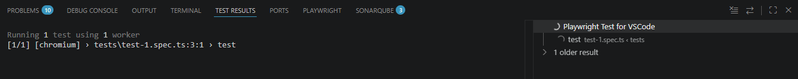


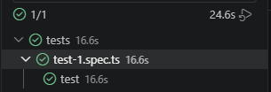

## Screenshots

Playwright can [capture](https://playwright.dev/docs/screenshots) and [compare screenshots](https://playwright.dev/docs/test-snapshots).

### Capture

Capturing the images will store them locally. It depends on you to figure out what to do with these images. For intsance, the test saves two images locally. These are not further processed by Playwright.

* [dialog_open.png](./dialog_open.png) and
* [dialog_closed.png](./dialog_closed.png)

### Visual comparison / regression

For visual comparison (regression tests), add _await expect(page).toHaveScreenshot();_ after an action. The first time the test is run, it will fail. No reference screenshots exists, therefore the test will fail.

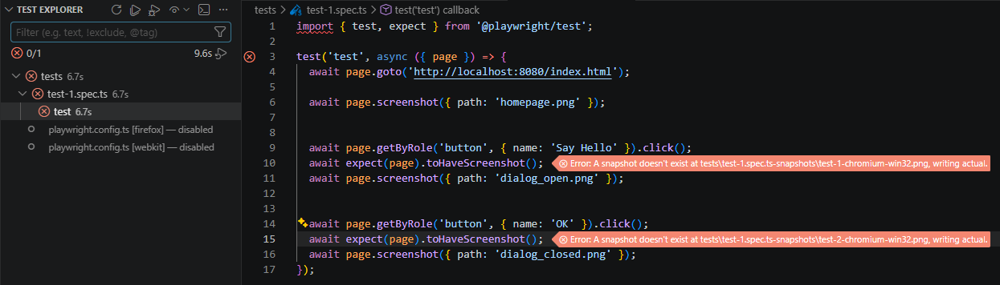

Playwright will still capture the images and add them to the test folder.

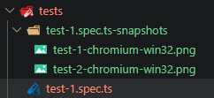

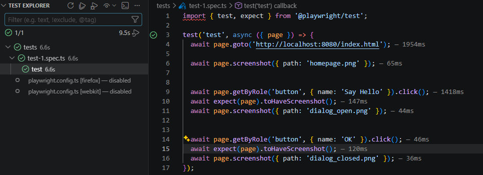

## Failing test

Change the text of the button and in the dialog to say hello world app. Running the test will give an error.

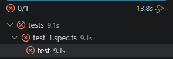

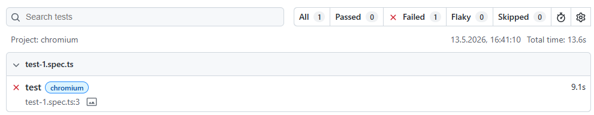

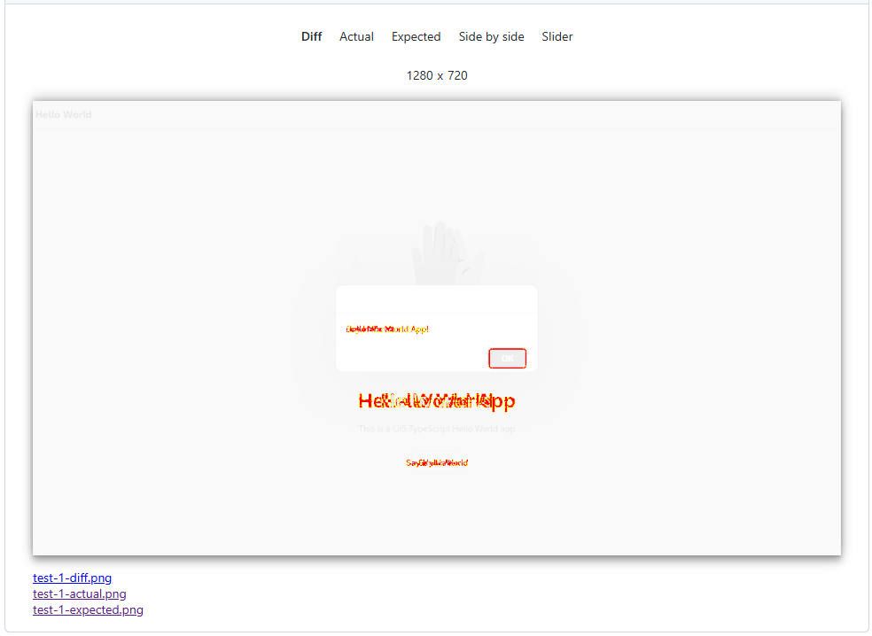
