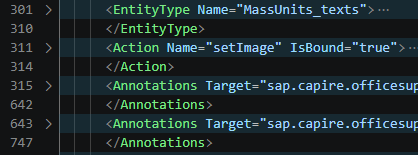
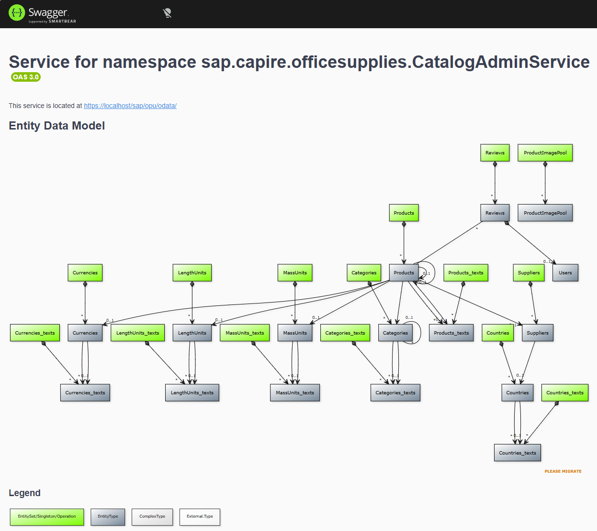
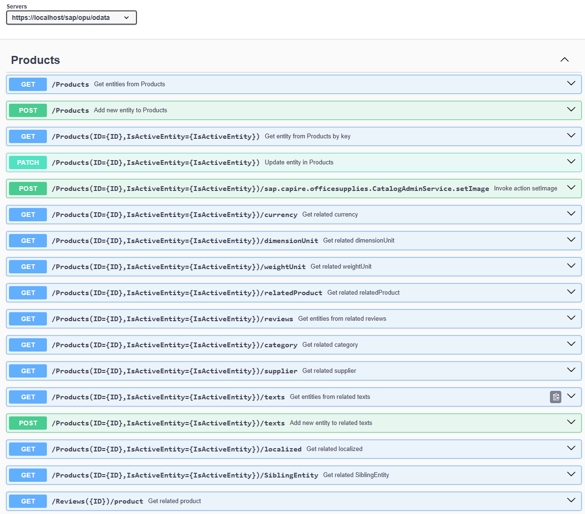

# OpenAPI Example

The backbone of many UI5 and Fiori apps is a backend service. In the SAP universe, this is normally an OData service: OData v2 or OData v4. To consume such an API is very easy with UI5 or Fiori Elements apps. However, in enterprise environments, an API Hub might be used where these APIs need to be published or consumed from. Technically, this isn't a big problem. OData exposes a service as an API, it is REST and the protocol allows using JSON. What might be needed and is normally missing, is to provide the OData API as [OpenAPI](https://github.com/OAI/OpenAPI-Specification).

The generic solution to convert an OData v2 / v4 metdata.xml to OpenAPI os [odata-openapi](https://github.com/oasis-tcs/odata-openapi). A [npm based app is available](https://github.com/oasis-tcs/odata-openapi/tree/main/lib) that transforms an OData metadata xml to OpenAPI. This solution is also used by CAP for producing an OpenAPI description. The app can be run using npx.

## OData metadata

The example UI5 hello world app is not using an OData service, and therefore comes without a metadata.xml file. At the [SAPUI5 SDK site](https://ui5.sap.com/#/demoapps) there are several demo apps that use an OData service available. For instance, the app "[Key User Adaptation for SAP Fiori Elements V4](https://ui5.sap.com/test-resources/sap/ui/demoapps/demokit/rta/fev4/test/index.html?sap-ui-theme=sap_horizon#product-display)". The metadata file is reachable either by calling the app and take the XML from the network trace, or by downloading the app.

The xml file is included in this example: [metadata.xml](./metadata.xml).


Most of the 2011 lines are related to Annotations.



## Convert metadata.xml

```sh
npm install -g odata-openapi
npx odata-openapi3 metadata.xml
```

Several parameters are available. To generate a pretty formatted json, including the YUML diagram with basePath set to /sap/opu/odata, run:

```sh
npx odata-openapi3 -p --basePath /sap/opu/odata -d metadata.xml
```

The output is in file [metadata.openapi3](./metadata.openapi3). To display the OpenAPI file in the browser, use open-sagger-ui.

```sh
npx open-swagger-ui --open .\metadata.openapi3.json
```




