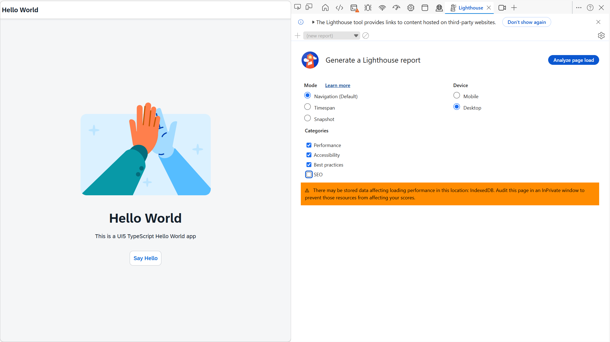
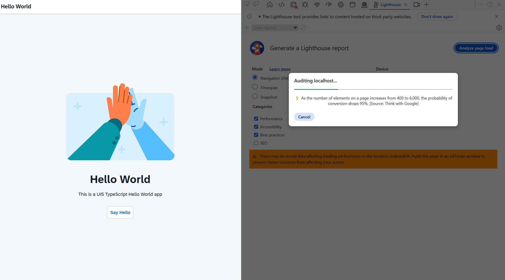
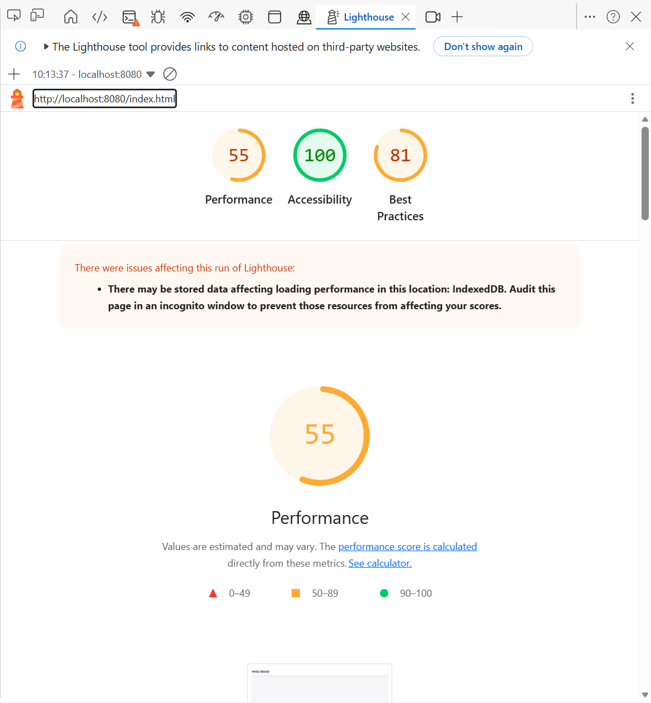
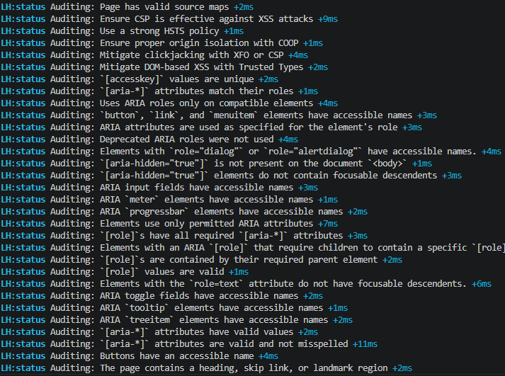
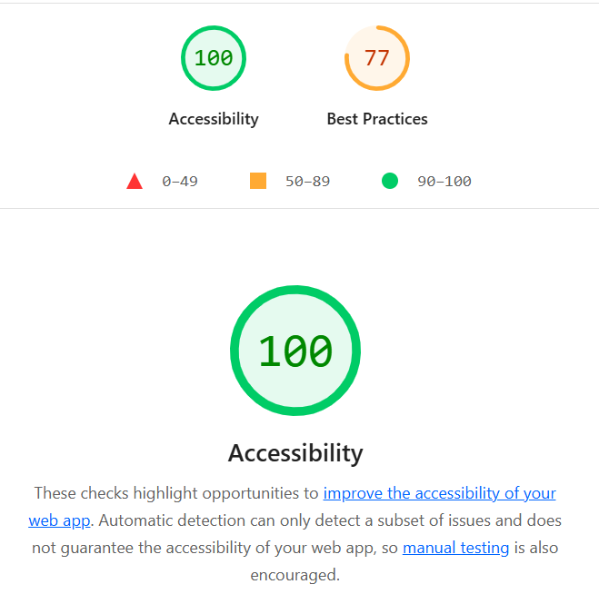

# Lighthouse Example

[Lighthouse](https://en.wikipedia.org/wiki/Lighthouse_(software)) is a tool from Google to check a web site against several parameters like speed, accessibility or best practices. [The software](https://developer.chrome.com/docs/lighthouse) comes in different flavors like a website, Chrome extension, [CLI or Node.JS module](https://github.com/GoogleChrome/lighthouse). It is around alredy for several years and is widely adopted as it comes shipped with Chrome. The metrics it checks and the scores calculated are targeted at websites. That is: public websites targeted at end users.

## Metrics

Lightouse allows to check a website for metrics like

- performance
- accessibility
- best practices
- SEO

While the scores are generally accepted as best practice - if, when not Google, knows how to evaluate a web site? - the scores for performance cannot and should not taken 1:1 for intranet websites or (internal) company apps. Going for a 100% score in performance might not be even achievable for company apps. For accessibilty and best practices the scores can be applied as is. SEO is not relevant when the app is internal only.

## Usage

### Chrome

Lighthouse can be run directly from the browser. Start the UI5 app, open the browser, and run Lighthouse via the developer tools

```sh
npm start
```







### CLI

Lighthouse can be run from CLI via npm. The [GitHub repo shows how to install and run it](https://github.com/GoogleChrome/lighthouse#using-the-node-cli). You can run lighthouse via npx:

```sh
npx lighouse
```

Parameters to consider are:

- --preset
- --only-categories
- --output-path

--preset=desktop will run Lighthouse in desktop mode, and not mobile (default).

--only-categories="accessibility,best-practices" will only run the tests for a11y and best practices.

```sh
npx lighthouse http://localhost:8080/index.html --preset=desktop --only-categories="accessibility,best-practices" --output-path ./report.html
```

THe actions perfomed by lighthouse are logged in the console. If you do not want these, add --quiet.



The result is given by default as a HTML site. This can be changed to JSON. For history logging, you can keep the default output path and the HTML file will contain a times stamp. To directly get the result shown, add --view

```sh
npx lighthouse http://localhost:8080/index.html --preset=desktop --only-categories="accessibility,best-practices" --output-path ./report.html --view
```



### Package.json

Lighthouse can be added to package.json as a script:

```json
"lighthouse": "lighthouse http://localhost:8080/index.html --output html --output-path ./lighthouse-report.html"
```

It can be run via npm:

```sh
npm run lighhouse
```
