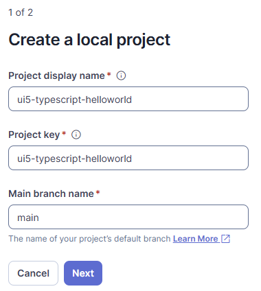
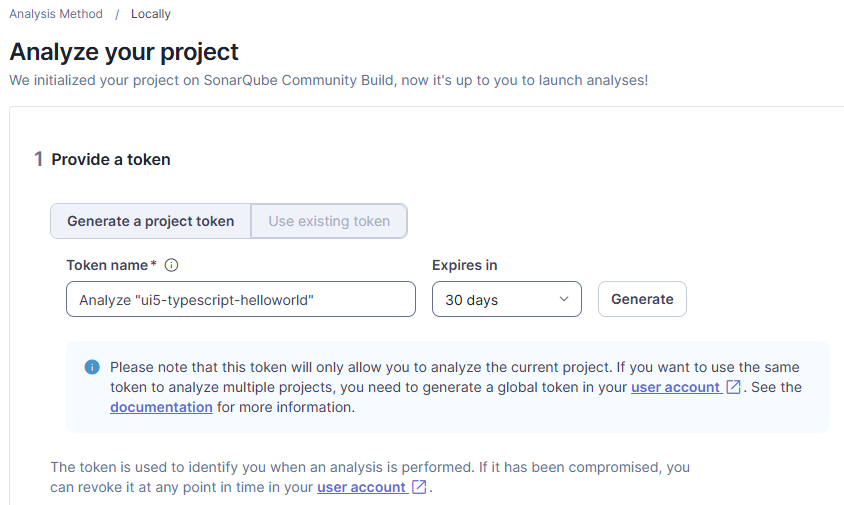
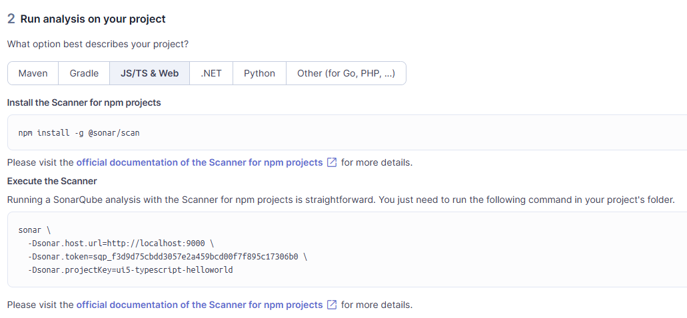
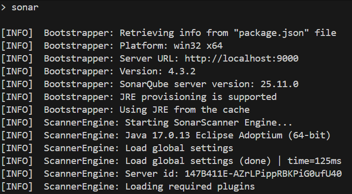
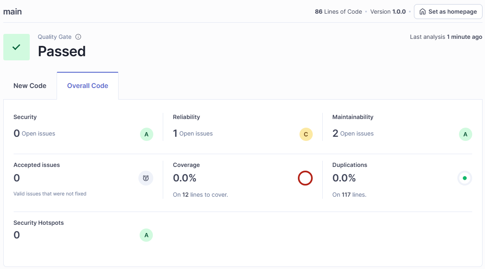
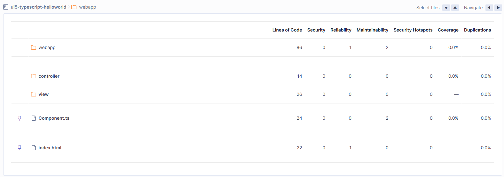
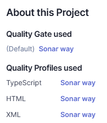
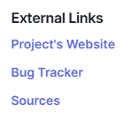

# SonarQube Example

[SonarQube](https://www.sonarsource.com/) is a tool to scan code and check its quality. It is widely used for scanning code and comes also in an open source version that is free to use. Its strength is at scanning JavaScript and Java based projects. It depends on a client (runner/scanner) and a server.

The scan setup demands to configure the server, a project, and the client with the project and connection information.

## Installation

```sh
npm i -D @sonar/scan
```

## Configuration

The [documentation from SonarSource](https://docs.sonarsource.com/sonarqube-community-build/analyzing-source-code/scanners/npm/configuring) explains the individual properties needed to configure. Some properties are taken from [package.json](./package.json), some are set in the SonarQube configuration file [sonar-project-properties](./sonar-project.properties).

Properties taken from package.json:

| sonar property | package.json property |
| :--- | :--- |
| sonar.projectName | name |
| sonar.projectVersion | version |
| sonar.projectDescription | description |
| sonar.links.homepage | homepage |
| sonar.links.issue | bugs.url |
| sonar.links.scm | repository.url |

Porperties set in the properties file

```json
sonar.projectKey=ui5-typescript-helloworld
sonar.host.url=https://<your sonarqube server>
sonar.sources=webapp/
sonar.exclusions=webapp/localService/**/*,webapp/test/**/*
sonar.javascript.lcov.reportPath=coverage/lcov.info
sonar.token=[[token]]
```

The sample sonar-project.properties provided in this repo excludes the test files (webapp/test) from the analysis and takes code coverage information (lcov.info) into consideration. How to get the code coverage is part of a different branch.

The sonar.token is provided by the SonarQube project configuration. The steps to get this token is detailed below.

## Self-signed certificate

<details>

<summary>Running a SonarQube server with a self-signed certificate needs a special configuration</summary>

Documentation: [SonarQube scanner fails due to self-signed certificate in certificate chain](https://www.itsfullofstars.de/2025/12/sonarqube-scanner-fails-due-to-self-signed-certificate-in-certificate-chain/)

Parameters needed when running SonarQube with a self-signed certificate

```
sonar.scanner.truststorePath=truststore.p12
sonar.scanner.turststorePassword=changeit
```

To make the scanner work with a custom certificate, a trust must be established. This is done by importing the custom certificates into a trust store. This trust store is used by the scanner to validate the connection to the server. The example is using the (public) certificate from my web server www.itsfullofstars.de. Make sure to use your own SonarQube server certificates!

Truststore file: [truststore.p12](./truststore.p12)

Get the server certificate. Store it in file certs.pem. The gets the certificate chain (server + ca certificates).

```sh
keytool -printcert -rfc -sslserver www.itsfullofstars.de > certs.pem
```

Copy & paste each certificate from certs.pem in a separate file: cert1.pem, cert2.pem (and if your cert chain contains more certificates: certX.pem). Import each certificate into the keystore.

Create keystore

```sh
type cert1.pem | keytool -import -alias test1 -keystore truststore.p12 -storepass test1234 -noprompt
type cert2.pem | keytool -import -alias test2 -keystore truststore.p12 -storepass test1234 -noprompt
```

</details>

## Create SonarQube project

This sets up a SonarQube project and a token. By running the first scan, the project information from the scanner is bound to the SonarQube project.

### Create a SonarQube project



Project key: **ui5-typescript-helloworld**

The project key is used in the **sonar-project.properties** property **sonar.projectKey**.

### Create token



The generated token is used in the **sonar-project-properties** property **sonar.token**.

### Run analysis sample configuration

The SonarQube server project setup step shows a sample configuration depending on your project. For JavaScrip/TypeScripte (like an UI5 project), the JS/TS & Web tab shows what is needed to run the scanner.



Providing the needed information for the scanner to start the scan in the sonar-projects.property file is sufficient to analyze a project. Start the sonar scanner.

## Run SonarQube scan

You can run a scan directly via CLI by running

```sh
npx @sonar/scan
```

To add sonar scan to package.json to run it via npm:

```json
"scripts": {
    "sonar": "sonar"
}
```

Running a scan is then done via

```sh
npm run sonar
```



##  Result

The analyze result is accessible in the [SonarQube web UI](http://localhost:9000/dashboard?id=ui5-typescript-helloworld&codeScope=overall)



At the project information section the applied rules and the information taken from the package.json are visible. In case coverage information (lcov.info) is provided, SonarQube will show the percentage and lines of code covered by tests.

## Analyzed Code

The analyzed code does not include the test folder from webapp.



### Rules

The applied rules can be used as-is or customized to individual, project or company requirements.



### Project Information

Additional project information can also be configured, like a website, bug tracker or where to find the sources. In companies, the website might piont to e.g. the project website. This information is taken from package.json.

```json
"homepage": "https://github.com/tobiashofmann/ui5-typescript-helloworld",
"repository": {
"type": "git",
"url": "https://github.com/tobiashofmann/ui5-typescript-helloworld.git"
},
"bugs": {
"url": "https://github.com/tobiashofmann/ui5-typescript-helloworld/issues"
},
```



| Name | Target |
| :--- | :---   |
| Project's Website | https://github.com/tobiashofmann/ui5-typescript-helloworld |
| Bug Tracker | https://github.com/tobiashofmann/ui5-typescript-helloworld/issues |
| Sources | https://github.com/tobiashofmann/ui5-typescript-helloworld |
