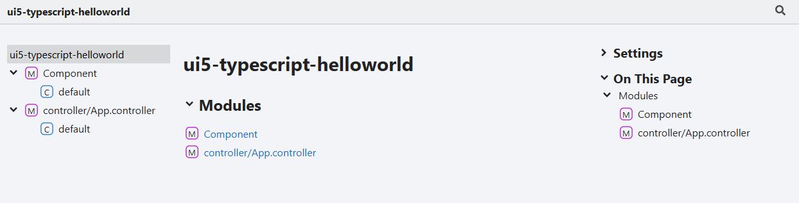
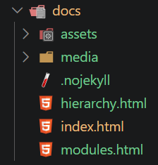
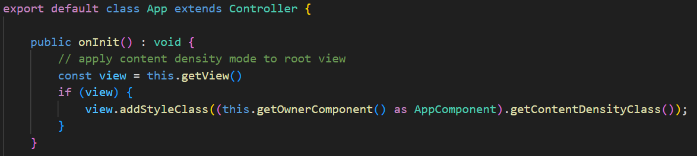
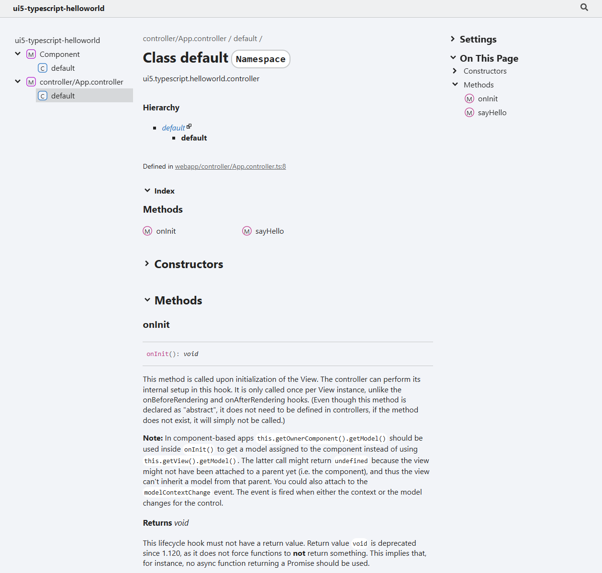
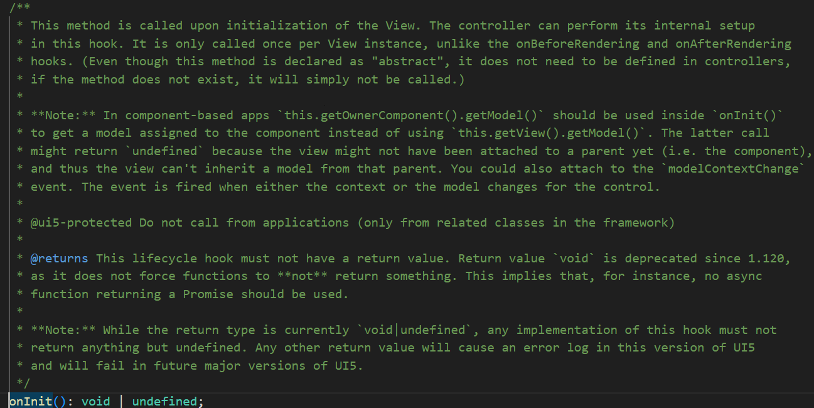

**ui5-typescript-helloworld**

***

# Typedoc Example

This example shows how to transform the code comments from the TypeScript files into documentation. The sample UI5 app is written in TypeScript, therefore [TypeDoc](https://typedoc.org/) is used: "TypeDoc converts comments in TypeScript's source code into HTML documentation or a JSON model."

## Installation

```sh
npm install --save-dev typedoc
```

## Usage

TypeDoc allows to convert the source code comments to HTML. The documentation can be accessed by a browser and made available to other users or stakeholders of the project. Using a CI/CD pipeline, the documentation can be generated on each release and added as a GitHub/GitLab page to the repository.



## Run TypeDoc

Add the script doc to package.json

```json package.json
"scripts": {
    "doc": "typedoc"
}
```

Typdoc can be run from CLI by invoking the npm script doc.

```sh
npm run doc
```

TypeDoc reads its configuration options from tsconfig or package.json and can be run via npx too.

```sh
npx typedoc
```

The output is stored in directory doc.



### Plugins

TypeDoc can enhanced via plugins. A list of plugins is available at the [project homepage](https://typedoc.org/documents/Plugins.html).

#### Coverage plugin

The coverage plugin for TypeDoc shows the code documentation coverage as an SVG that can be used to display the overall documentation status of the project. The output is a SVG file that shows the coverage percentage:


To add the coverage plugin:

```sh
npm i -D typedoc-plugin-coverage
```

**More information**

* [npm](https://www.npmjs.com/package/typedoc-plugin-coverage)
* [GitHub](https://github.com/Gerrit0/typedoc-plugin-coverage)

#### DT links

To be able to reference references to referenced @types packages, add the plugin [typedoc-plugin-dt-links]()https://www.npmjs.com/package/typedoc-plugin-dt-links).

**More information**

* [npm](https://www.npmjs.com/package/typedoc-plugin-dt-links)
* [GitHub](https://github.com/Gerrit0/typedoc-plugin-dt-links)

## Configuration

The configuration can be included in the TS config file tsconfig.json. The config property is typedocOptions and can be added at the end of the tsconfig object. The options can be adjusted. For instance, to have the documentation be generated in German, use "lang": "de".

```json
"typedocOptions": {
    "entryPoints": [
        "webapp/**/*.ts"
    ],
    "exclude": [
        "webapp/test/**/*"
    ],
    "outputs": [
      {
        "name": "markdown",
        "path": "./doc/markdown"
      },
      {
        "name": "html",
        "path": "./doc/html"
      }
    ],
    "lang": "en",
    "cacheBust": true,
    "hideGenerator": true,
    "searchInComments": true,
    "plugin": [
        "typedoc-plugin-coverage",
        "typedoc-plugin-markdown",
        "typedoc-plugin-dt-links"
    ],
    "coverageOutputPath": "./doc/doccoverage.svg",
    "coverageLabel": "Documented",
    "coverageSvgWidth": 120
}
```

The configuration instructs TypeDoc to load 3 plugins (typedoc-plugin-coverage, typedoc-plugin-markdown, typedoc-plugin-dt-links), use English as output language, use a cache buster mechanism, enables search inside comments and generates a documentation coverage SVG image.

```sh
npm i -D typedoc-plugin-coverage typedoc-plugin-markdown typedoc-plugin-dt-links
npm run doc
```

## Result

The folder doc/html contains the HTML output. Opening the file index.html gives access to the documentation in a browser.


A nice feature of TypeDoc is that it understands classes. The method onInit in the [App.controller.ts](controller/App.controller/README.md) contains no TypeDoc comments.



The generated TypeDoc documentation contains documentation for onInit:



This documentation is taken from the Controller class the App controller extends from. SAP provides the necessary onInit documentation as sap.ui.core.d.ts:


